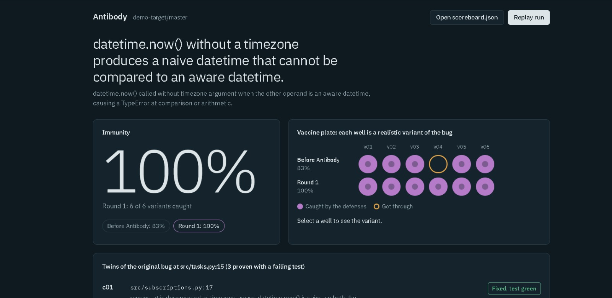
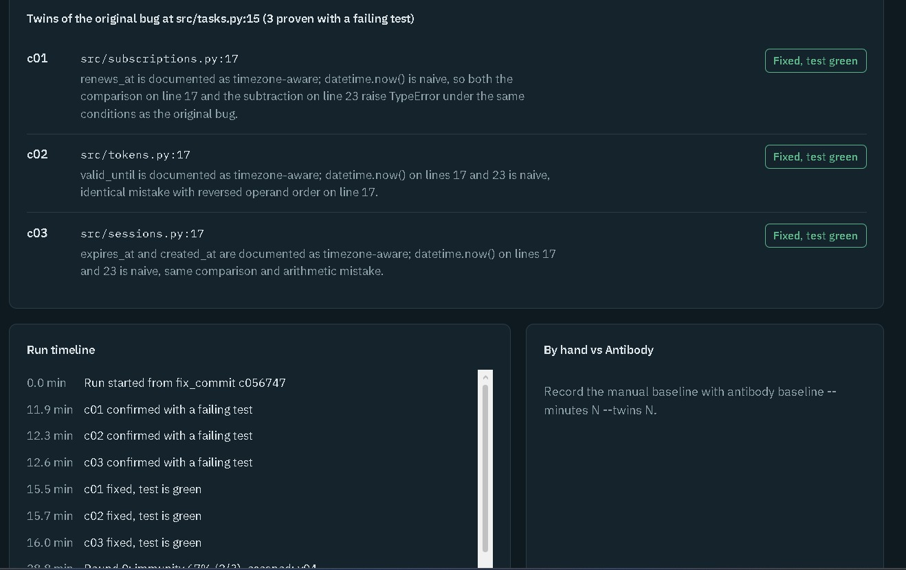

# Demo run

Screenshots of the scoreboard for the run shown in the demo video, on the
team's practice repository [demo-target](https://github.com/JoaquinYap/demo-target)
(twins seeded by hand, fix commit `c056747`). The run's `scoreboard.json` stayed
on the machine that ran it, because `.antibody/` is git-ignored there.

To see the scoreboard with example data, serve the repo root with
`python -m http.server 8000` and open `ui/scoreboard.html`. More detail on the
[landing page](https://landing-antibody.vercel.app/).
